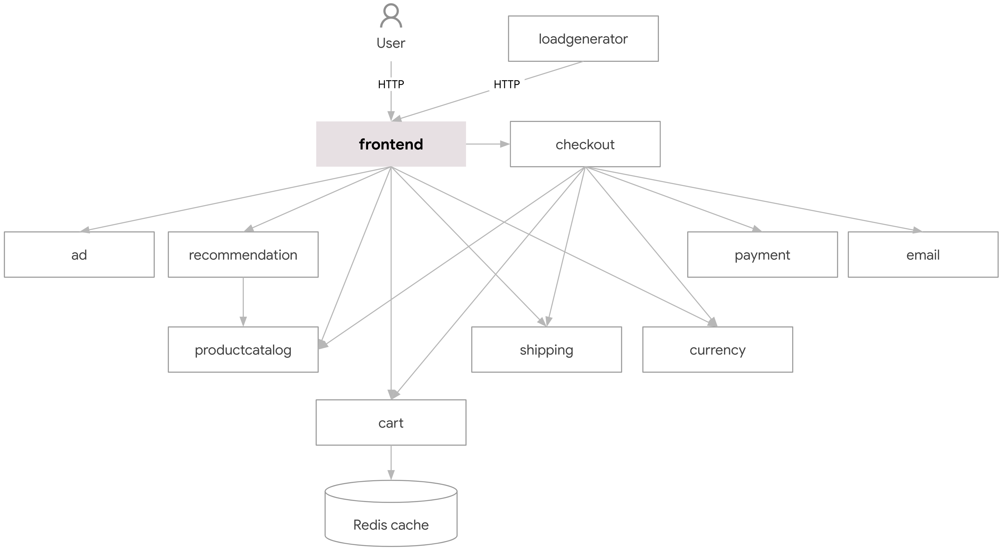
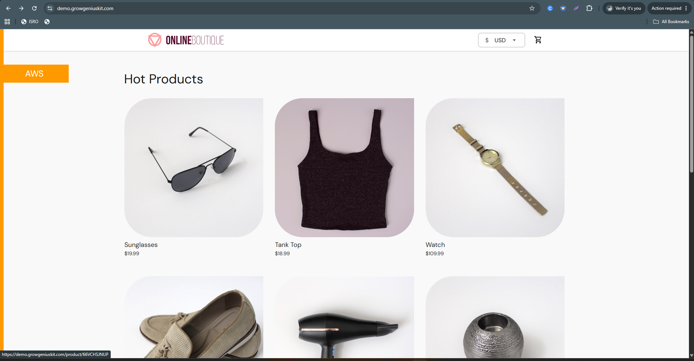
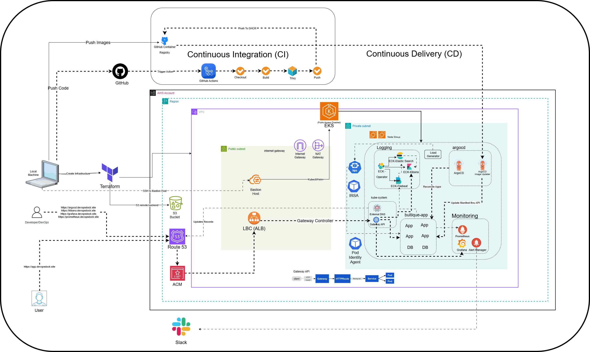
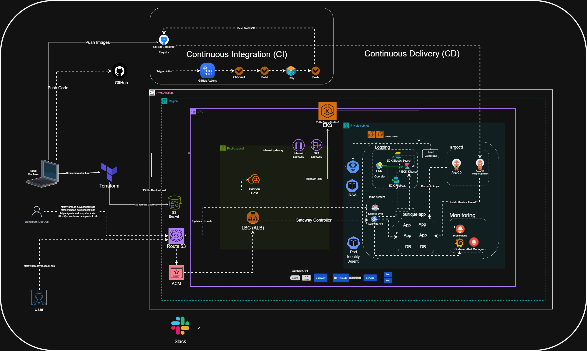
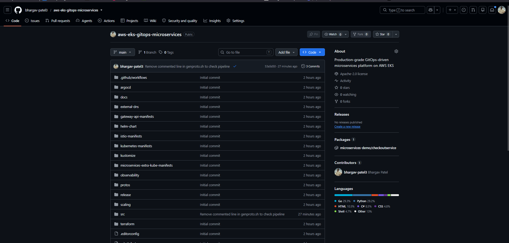
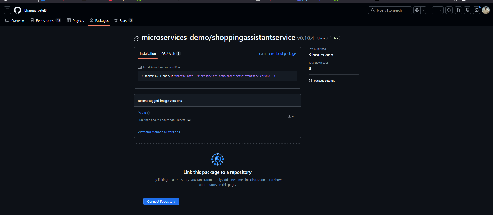

# Project Introduction

# Intro to Online Boutique App

This is a type of e-commerce platform, but unlike Amazon-type stores, it focuses on:

- **Niche or curated products**
- **Unique / limited collections**
- **Strong brand identity & style**

Think of it as a **digital version of a small, stylish fashion store**.

But from a **technical perspective**, modern boutique apps are **not built as a single application**.

They are built using **Microservices Architecture**.

> [!TIP]
># What is Microservices?
>
>**Microservices** is an architectural style where an application is broken into **small, independent services**, and each service:
>
>- Handles a **specific business function**
>- Runs independently
>- Communicates via APIs
>
>👉 Instead of one big application (monolith), you have **multiple small services working together**.
>
>---
>
># Online Boutique = Microservices in Action
>
>This online boutique app is made up of multiple services like:
>
>### 🧾 Product Catalog Service
>
>- Manages product list, categories, pricing
>
>### 🛒 Cart Service
>
>- Handles user cart (add/remove items)
>
>### 💳 Payment Service
>
>- Processes payments (UPI, cards)
>
>### 📦 Order Service
>
>- Manages order lifecycle
>
>### 👤 Frontend Service
>
>- Authentication & profiles
>
>### 🚚 Shipping Service
>
>- Delivery tracking & logistics
>
>### Etc..
>
>---
>
># How These Services Communicate
>
>- REST APIs (HTTP)
>- gRPC (faster internal communication)
>- Message queues (Kafka / RabbitMQ)
>
>👉 Example:
>
>- Cart service → calls Product service
>- Order service → calls Payment service
>
>---
>
># Monolith vs Microservices
>
>### Monolithic App ❌
>
>- Everything in one codebase
>- Hard to scale
>- Single failure affects whole system
>
>### Microservices App ✅
>
>- Independent services
>- Easy to scale
>- Fault isolation
>
>👉 That’s why modern apps (like boutique apps) use microservices.


# **Architecture**

**Online Boutique** is composed of 11 microservices written in different languages that talk to each other over gRPC.



| **Service** | **Language** | **Description** |
| --- | --- | --- |
| [frontend](https://github.com/bhargav-patel3/aws-eks-gitops-microservices/blob/main/src/frontend) | Go | Exposes an HTTP server to serve the website. Does not require signup/login and generates session IDs for all users automatically. |
| [cartservice](https://github.com/bhargav-patel3/aws-eks-gitops-microservices/blob/main/src/cartservice) | C# | Stores the items in the user's shopping cart in Redis and retrieves it. |
| [productcatalogservice](https://github.com/bhargav-patel3/aws-eks-gitops-microservices/blob/main/src/productcatalogservice) | Go | Provides the list of products from a JSON file and ability to search products and get individual products. |
| [currencyservice](https://github.com/bhargav-patel3/aws-eks-gitops-microservices/blob/main/src/currencyservice) | Node.js | Converts one money amount to another currency. Uses real values fetched from European Central Bank. It's the highest QPS service. |
| [paymentservice](https://github.com/bhargav-patel3/aws-eks-gitops-microservices/blob/main/src/paymentservice) | Node.js | Charges the given credit card info (mock) with the given amount and returns a transaction ID. |
| [shippingservice](https://github.com/bhargav-patel3/aws-eks-gitops-microservices/blob/main/src/shippingservice) | Go | Gives shipping cost estimates based on the shopping cart. Ships items to the given address (mock) |
| [emailservice](https://github.com/bhargav-patel3/aws-eks-gitops-microservices/blob/main/src/emailservice) | Python | Sends users an order confirmation email (mock) |
| [checkoutservice](https://github.com/bhargav-patel3/aws-eks-gitops-microservices/blob/main/src/checkoutservice) | Go | Retrieves user cart, prepares order and orchestrates the payment, shipping and the email notification. |
| [recommendationservice](https://github.com/bhargav-patel3/aws-eks-gitops-microservices/blob/main/src/recommendationservice) | Python | Recommends other products based on what's given in the cart. |
| [adservice](https://github.com/bhargav-patel3/aws-eks-gitops-microservices/blob/main/src/adservice) | Java | Provides text ads based on given context words. |
| [loadgenerator](https://github.com/bhargav-patel3/aws-eks-gitops-microservices/blob/main/src/loadgenerator) | Python/Locust | Continuously sends requests imitating realistic user shopping flows to the frontend. |

Screenshots:



---

**Most services are stateless**, and **only the cart uses persistence (Redis)**. Let’s break it down cleanly.

# How data works in `microservices-demo`

This project is **designed** to:

- Demonstrate **microservice communication**
- Be **easy to deploy anywhere**
- Avoid complex database ops

So it uses **minimal persistence** on purpose.

---

## Service-by-Service Data Breakdown

### ✅ **cartservice** → ✔️ HAS persistence

**Storage used:**

- **Redis**

**What’s stored:**

- User cart items
- Quantity, product IDs

**Why Redis?**

- Fast
- Simple
- Easy to reset
- No schema complexity

📌 In Kubernetes:

- Redis runs as a pod (or StatefulSet)
- Cart data is lost if Redis is deleted (by default)

---

### ❌ **orders / checkout** → NO real database

There is **NO dedicated “orders database”**.

**checkoutservice:**

- Aggregates data from:
    - cartservice
    - paymentservice
    - shippingservice
    - emailservice
- Simulates order placement
- Does **not persist orders**

👉 This is **by design**, to keep the demo lightweight.

---

### ❌ **productcatalogservice**

**Storage:**

- Static JSON file
- Loaded into memory at startup

**No DB**

- Products reset on restart

---

### ❌ **recommendationservice**

**Storage:**

- Stateless
- Generates recommendations dynamically

---

### ❌ **paymentservice**

**Storage:**

- None
- Fake payment processor

---

### ❌ **shippingservice**

**Storage:**

- None
- Simulated shipping cost logic

---

### ❌ **emailservice**

**Storage:**

- None
- Just logs “email sent”

---

### ❌ **adservice**

**Storage:**

- In-memory ad data
- No persistence

---

### ❌ **frontend**

**Storage:**

- Stateless
- Just UI + API calls

---

### ❌ **currencyservice**

**Storage:**

- Static exchange rates
- In-memory only

---

## SUMMARY TABLE

| Service | Persistent Storage | Type |
| --- | --- | --- |
| cartservice | ✅ Yes | Redis |
| checkoutservice | ❌ No | Stateless |
| productcatalogservice | ❌ No | In-memory JSON |
| recommendationservice | ❌ No | Stateless |
| paymentservice | ❌ No | Fake |
| shippingservice | ❌ No | Fake |
| emailservice | ❌ No | Fake |
| adservice | ❌ No | In-memory |
| frontend | ❌ No | Stateless |
| currencyservice | ❌ No | In-memory |
| loadgenerator | ❌ No | Stateless |

---

> “The demo intentionally keeps most services stateless to simplify deployment and focus on platform concerns like CI/CD, observability, scaling, and networking.”
> 

---

# Project Architecture




---
---
---
---
# Implementation

## Install tools in Local Machine

- AWS CLI
- Terraform in your local machine
- Create an IAM user and create access key and secret access key for the user and do `aws configure`

Clone the repo:

```bash
git clone https://github.com/bhargav-patel3/aws-eks-gitops-microservices.git
```

Change directory to terraform:

```bash
cd aws-eks-gitops-microservices/terraform/
```

## Terraform Run

Clone the repo, `cd` to `terraform` directory. Do:

```bash
terraform init
terraform plan 
```

Verify the resources and then do:

```bash
terraform apply
```

After apply you should see the bastion host’s public IP as outputs.

At the current directory you would see the instance’s private key (`bastion-key.pem`) as well.

## Set up Terraform Remote Backend (Optional)

Create an S3 bucket using AWS CLI or AWS Console:

```bash
aws s3api create-bucket \
  --bucket bhargav-terraform-backend-bucket \
  --region ap-south-1 \
  --create-bucket-configuration LocationConstraint=ap-south-1
```

Enable versioning and bucket encryption:

```bash
# Enable versioning
aws s3api put-bucket-versioning \
  --bucket bhargav-terraform-backend-bucket \
  --versioning-configuration Status=Enabled

# Enable encryption
aws s3api put-bucket-encryption \
  --bucket bhargav-terraform-backend-bucket \
  --server-side-encryption-configuration '{
    "Rules":[{
      "ApplyServerSideEncryptionByDefault":{
        "SSEAlgorithm":"AES256"
      }
    }]
  }'
```

Add this backend block in `terraform.tf` file:

```terraform
terraform {
  backend "s3" {
    bucket = "bhargav-terraform-backend-bucket"
    key    = "s3-backend"
    region = "ap-south-1"
  }
}
```

Run `terraform init` to initialize it again:

As we already have the tfstate file locally, you will see a prompt to migrate your state to the remote backend.

Example Output:

```bash
Initializing the backend...
Do you want to copy existing state to the new backend?
  Pre-existing state was found while migrating the previous "local" backend to the
  newly configured "s3" backend. No existing state was found in the newly
  configured "s3" backend. Do you want to copy this state to the new "s3"
  backend? Enter "yes" to copy and "no" to start with an empty state.

  Enter a value: yes
```

Type `yes`, and the backend will move to S3.

Now the state will be read from the S3 backend.

## Bastion Host Configuration

SSH to the Bastion host from the same terraform directory as it creates the private key in the same directory:

```bash
ssh -i bastion-key.pem ubuntu@<bastion_public_ip>
```

Now install the below tools in the Bastion Host:

- AWS CLI
- kubectl client
- Helm
- eksctl

**Installation Resource Docs:**

- [AWS CLI Installation](https://docs.aws.amazon.com/cli/latest/userguide/getting-started-install.html)
- [kubectl Installation](https://kubernetes.io/docs/tasks/tools/install-kubectl-linux/#install-using-native-package-management)
- [Helm Installation](https://helm.sh/docs/intro/install/)
- [eksctl Installation](https://docs.aws.amazon.com/eks/latest/eksctl/installation.html)

Run `aws configure` and set up with your access and secret access keys.

Then, import the kubeconfig file by running:

```bash
aws eks update-kubeconfig --region ap-south-1 --name demo-terraform-cluster 
```

After adding the context, verify connection:

```bash
kubectl get nodes
```

Expected Output:

```bash
NAME                         STATUS   ROLES    AGE    VERSION
ip-10-0-1-248.ap-south-1.compute.internal   Ready    <none>   100m   v1.36.0-eks-ecaa3a6
ip-10-0-2-138.ap-south-1.compute.internal   Ready    <none>   100m   v1.36.0-eks-ecaa3a6
```

## Install AWS Load Balancer Controller

Docs:
- [AWS EKS User Guide - AWS Load Balancer Controller](https://docs.aws.amazon.com/eks/latest/userguide/lbc-helm.html)
- [AWS Load Balancer Controller Installation](https://kubernetes-sigs.github.io/aws-load-balancer-controller/latest/deploy/installation/)

Create an IAM OIDC provider. (You can skip this step if already configured via Terraform):

```bash
eksctl utils associate-iam-oidc-provider \
    --region ap-south-1 \
    --cluster demo-terraform-cluster \
    --approve
```

**Create IAM role using `eksctl`:**

1. Download an IAM policy for the AWS Load Balancer Controller:
    
    ```bash
    curl -O https://raw.githubusercontent.com/kubernetes-sigs/aws-load-balancer-controller/v2.14.1/docs/install/iam_policy.json
    ```
    
2. Create an IAM policy using the downloaded document:
    
    ```bash
    aws iam create-policy \
        --policy-name AWSLoadBalancerControllerIAMPolicy \
        --policy-document file://iam_policy.json
    ```
    
3. Associate IAM Service Account with the created policy:
    
    ```bash
    eksctl create iamserviceaccount \
        --cluster=demo-terraform-cluster \
        --namespace=kube-system \
        --name=aws-load-balancer-controller \
        --attach-policy-arn=arn:aws:iam::308703000956:policy/AWSLoadBalancerControllerIAMPolicy \
        --override-existing-serviceaccounts \
        --region ap-south-1 \
        --approve
    ```

**Install AWS Load Balancer Controller via Helm:**

1. Add the `eks-charts` Helm chart repository:
    
    ```bash
    helm repo add eks https://aws.github.io/eks-charts
    ```
    
2. Update local charts cache:
    
    ```bash
    helm repo update eks
    ```
    
3. Install the AWS Load Balancer Controller:
    
    ```bash
    helm upgrade -i aws-load-balancer-controller eks/aws-load-balancer-controller \
      -n kube-system \
      --set clusterName=demo-terraform-cluster \
      --set region=ap-south-1 \
      --set vpcId=<your-vpc-id> \
      --set serviceAccount.create=false \
      --set serviceAccount.name=aws-load-balancer-controller \
      --set controllerConfig.featureGates.NLBGatewayAPI=true \
      --set controllerConfig.featureGates.ALBGatewayAPI=true \
      --version 3.0.0
    ```

**Verify that the controller is installed:**

```bash
kubectl get deployment -n kube-system aws-load-balancer-controller
```

Example output:

```bash
NAME                           READY   UP-TO-DATE   AVAILABLE   AGE
aws-load-balancer-controller   2/2     2            2           84s
```

## Gateway API

Docs: [AWS Load Balancer Controller Gateway API Guide](https://kubernetes-sigs.github.io/aws-load-balancer-controller/latest/guide/gateway/l7gateway/)

**Installation of Gateway API CRDs:**

- Standard Gateway API CRDs: [REQUIRED]
    
    ```bash
    kubectl apply -f https://github.com/kubernetes-sigs/gateway-api/releases/download/v1.3.0/standard-install.yaml
    ```
    
- Experimental Gateway API CRDs: [OPTIONAL: Used for L4 Routes]
    
    ```bash
    kubectl apply -f https://github.com/kubernetes-sigs/gateway-api/releases/download/v1.3.0/experimental-install.yaml
    ```
    
- Installation of LBC Gateway API specific CRDs:
    
    ```bash
    kubectl apply -f https://raw.githubusercontent.com/kubernetes-sigs/aws-load-balancer-controller/refs/heads/main/config/crd/gateway/gateway-crds.yaml
    ```

> [!NOTE]
> All configuration files are available in the repository under `gateway-api-manifests/`.

**1. Create a GatewayClass:**

`gateway-api-manifests/gateway-class.yaml`

```yaml
apiVersion: gateway.networking.k8s.io/v1beta1
kind: GatewayClass
metadata:
  name: aws-alb-gateway-class
spec:
  controllerName: gateway.k8s.aws/alb
```

Apply the manifest:

```bash
kubectl apply -f gateway-api-manifests/gateway-class.yaml
```

**2. Create the LoadBalancerConfiguration:**

This is required for the AWS Load Balancer Controller to bind the ACM certificate and configure listener parameters.

`gateway-api-manifests/alb-config.yaml`

```yaml
apiVersion: gateway.k8s.aws/v1 
kind: LoadBalancerConfiguration
metadata:
  name: app-gw-lbconfig
  namespace: default
spec:
  scheme: internet-facing
  listenerConfigurations:
    - protocolPort: HTTPS:443
      defaultCertificate: arn:aws:acm:ap-south-1:308703000956:certificate/054f23a0-382a-4692-a5f1-30f364213c0c
```

Apply:

```bash
kubectl apply -f gateway-api-manifests/alb-config.yaml
```

**3. Create the Gateway:**

`gateway-api-manifests/gateway.yaml`

```yaml
apiVersion: gateway.networking.k8s.io/v1beta1
kind: Gateway
metadata:
  name: app-alb-gateway
  namespace: default
spec:
  gatewayClassName: aws-alb-gateway-class
  infrastructure:
    parametersRef:
      kind: LoadBalancerConfiguration
      name: app-gw-lbconfig
      group: gateway.k8s.aws
  listeners:
  - name: http
    protocol: HTTP
    port: 80
    hostname: "*.growgeniuskit.com"
    allowedRoutes:
      namespaces:
        from: All
  - name: https
    protocol: HTTPS
    hostname: "*.growgeniuskit.com"
    port: 443
    allowedRoutes:
      namespaces:
        from: All
```

Apply Gateway manifests:

```bash
kubectl apply -f gateway-api-manifests/gateway.yaml
```

Verify the gateway in Kubernetes and AWS Management Console:

```bash
kubectl get gateway
```

Example Output:

```bash
NAME              CLASS                   ADDRESS                                                                  PROGRAMMED   AGE
app-alb-gateway   aws-alb-gateway-class   k8s-default-appalbga-65aa25bc91-1838810992.ap-south-1.elb.amazonaws.com   Programmed   5s
```

## Deploying External DNS

Docs: 
- [ExternalDNS AWS Tutorial](https://github.com/kubernetes-sigs/external-dns/blob/master/docs/tutorials/aws.md#using-helm-with-oidc)
- [ExternalDNS Gateway API Guide](https://kubernetes-sigs.github.io/external-dns/v0.13.1/tutorials/gateway-api/#manifest-with-rbac)

Create IAM policy document for Route 53 permissions:

`external-dns/policy.json`

```json
{
  "Version": "2012-10-17",
  "Statement": [
    {
      "Effect": "Allow",
      "Action": [
        "route53:ChangeResourceRecordSets",
        "route53:ListResourceRecordSets",
        "route53:ListTagsForResources"
      ],
      "Resource": [
        "arn:aws:route53:::hostedzone/*"
      ]
    },
    {
      "Effect": "Allow",
      "Action": [
        "route53:ListHostedZones"
      ],
      "Resource": [
        "*"
      ]
    }
  ]
}
```

Create policy from the policy document:

```bash
aws iam create-policy --policy-name "AllowExternalDNSUpdates" --policy-document file://external-dns/policy.json

export POLICY_ARN=$(aws iam list-policies \
 --query 'Policies[?PolicyName==`AllowExternalDNSUpdates`].Arn' --output text)
 
export EKS_CLUSTER_NAME=demo-terraform-cluster
```

**Deploy ExternalDNS using EKS Pod Identity:**

Create a namespace:

```bash
kubectl create ns external-dns
```

Associate pod identity:

```bash
eksctl create podidentityassociation \
  --cluster $EKS_CLUSTER_NAME \
  --namespace external-dns \
  --service-account-name external-dns \
  --role-name external-dns-pod-identity-role \
  --permission-policy-arns $POLICY_ARN
```

Add the ExternalDNS Helm repository:

```bash
helm repo add external-dns https://kubernetes-sigs.github.io/external-dns/
```

Deploy ExternalDNS configured with Gateway API sources:

```bash
helm install external-dns external-dns/external-dns \
  -n external-dns \
  -f external-dns/external-dns-values-1.20.0.yaml \
  --version 1.20.0
```

Verify ExternalDNS pod status:

```bash
kubectl get pod -n external-dns
```

Output:

```bash
NAME                            READY   STATUS    RESTARTS   AGE
external-dns-6f95d4687d-6tc2g   1/1     Running   0          94s
```

## Deploy ArgoCD

Docs: [ArgoCD Helm Chart](https://artifacthub.io/packages/helm/argo/argo-cd) 

**Add ArgoCD repo:**

```bash
helm repo add argo https://argoproj.github.io/argo-helm
```

Key customizations in `argocd/argocd-values-9.4.0.yaml`:

1. **`server.insecure: true`**: Since TLS terminates at the AWS ALB, ArgoCD server runs in insecure mode internally.
2. **`kustomize.buildOptions: "--enable-helm"`**: Enables Kustomize to render remote OCI Helm charts.
3. **`httproute.enabled: true`**: Configures Gateway API HTTPRoute for `argocd.growgeniuskit.com`.

Install ArgoCD:

```bash
helm install argo-cd argo/argo-cd -n argocd -f argocd/argocd-values-9.4.0.yaml --version 9.4.0 --create-namespace
```

**Apply TargetGroupConfiguration for ArgoCD Server:**

`argocd/target-grp-config.yaml`

```yaml
apiVersion: gateway.k8s.aws/v1beta1
kind: TargetGroupConfiguration
metadata:
  name: argo-tg-config
  namespace: argocd
spec:
  targetReference:
    name: argo-cd-argocd-server
  defaultConfiguration:
    targetType: ip
```

Apply:

```bash
kubectl apply -f argocd/target-grp-config.yaml 
```

> [!NOTE]
> `TargetGroupConfiguration` is specifically required for AWS Load Balancer Controller when routing traffic directly from AWS ALB to pod IPs with Gateway API.

Access ArgoCD in the browser:

```
https://argocd.growgeniuskit.com
```

Retrieve the auto-generated admin password:

```bash
kubectl -n argocd get secret argocd-initial-admin-secret -o jsonpath="{.data.password}" | base64 -d
```

Login with username `admin` and the retrieved password, then update your password in **User Info → Update Password**.

## Continuous Integration (CI) with GitHub Actions

To modularize the application and enable automated CI/CD:
1. Docker images for all 11 microservices are built, scanned for vulnerabilities using **Trivy**, and pushed to GitHub Container Registry (`ghcr.io/bhargav-patel3/microservices-demo/<service>`).
2. The Helm chart is packaged as an OCI artifact and pushed to GitHub Container Registry (`oci://ghcr.io/bhargav-patel3/onlineboutique`).

### Package & Link Helm Chart to GHCR

Package the chart:

```bash
cd helm-chart/
helm package .
```

Login to GHCR and push the chart:

```bash
echo $GITHUB_TOKEN | helm registry login ghcr.io -u bhargav-patel3 --password-stdin
helm push onlineboutique-0.10.4.tgz oci://ghcr.io/bhargav-patel3
```

Once pushed, link the package to your repository in GitHub Packages:



Go to **Package Settings → Package Access**, add your repository and grant **Write** access so GitHub Actions workflows can publish image tags.




### CI Workflow Definitions

The CI pipeline consists of two workflows in `.github/workflows/`:

**1. Reusable Build Workflow (`.github/workflows/microservice-ci.yaml`)**

```yaml
name: Microservice CI

on:
  workflow_call:
    inputs:
      service:
        required: true
        type: string

jobs:
  build:
    runs-on: ubuntu-latest
    env:
      IMAGE_NAME: ghcr.io/${{ github.repository_owner }}/microservices-demo/${{ inputs.service }}:sha-${{ github.sha }}

    steps:
      # -------------------
      # Checkout source
      # -------------------
      - name: Checkout code
        uses: actions/checkout@v4

      # -------------------
      # Docker Buildx (cache support)
      # -------------------
      - name: Set up Docker Buildx
        uses: docker/setup-buildx-action@v3

      # -------------------
      # Login to GHCR
      # -------------------
      - name: Login to GHCR
        uses: docker/login-action@v3
        with:
          registry: ghcr.io
          username: ${{ github.actor }}
          password: ${{ secrets.GITHUB_TOKEN }}

      # -------------------
      # Build Docker image (cached)
      # -------------------
      - name: Build Image
        run: |
          BUILD_CONTEXT="./src/${{ inputs.service }}"
          if [ "${{ inputs.service }}" = "cartservice" ]; then
            BUILD_CONTEXT="${BUILD_CONTEXT}/src"
          fi
          docker build \
            --cache-from=type=gha \
            --cache-to=type=gha,mode=max \
            -t $IMAGE_NAME \
            "$BUILD_CONTEXT"

      # -------------------
      # Security Scan (before push)
      # -------------------
      - name: Run Trivy Scan
        uses: aquasecurity/trivy-action@0.20.0
        with:
          scan-type: image
          image-ref: ${{ env.IMAGE_NAME }}
          severity: HIGH,CRITICAL
          exit-code: 0
          vuln-type: os,library

      # -------------------
      # Push image (only if scan passes)
      # -------------------
      - name: Push Image
        run: |
          docker push $IMAGE_NAME
```

**2. Trigger Workflow (`.github/workflows/ci-trigger.yaml`)**

Detects changed directories under `src/` on commits to `main` and invokes the matrix build for affected services:

```yaml
name: Microservices Trigger CI

on:
  push:
    branches: [ main ]
    paths:
      - "src/**"

permissions:
  contents: read
  packages: write

jobs:
  # -------------------------------
  # Job 1: Detect changed services
  # -------------------------------
  detect-changes:
    runs-on: ubuntu-latest
    outputs:
      services: ${{ steps.changed.outputs.services }}

    steps:
      - name: Checkout repo
        uses: actions/checkout@v4
        with:
          fetch-depth: 0

      - name: Detect changed services
        id: changed
        run: |
          SERVICES=$(git diff --name-only ${{ github.event.before }} ${{ github.sha }} \
            | grep '^src/' \
            | cut -d'/' -f2 \
            | sort -u \
            | jq -R -s -c 'split("\n")[:-1]')

          echo "Detected services: $SERVICES"
          echo "services=$SERVICES" >> $GITHUB_OUTPUT

  # --------------------------------------------------
  # Job 2: Call reusable workflow (matrix per service)
  # --------------------------------------------------
  build-and-push:
    needs: detect-changes
    if: needs.detect-changes.outputs.services != '[]'

    strategy:
      fail-fast: false
      matrix:
        service: ${{ fromJson(needs.detect-changes.outputs.services) }}

    uses: ./.github/workflows/microservice-ci.yaml
    with:
      service: ${{ matrix.service }}
```

## Continuous Delivery (CD) with ArgoCD & Kustomize

To deploy the application via GitOps and expose it through the AWS Gateway API:

**1. Target Group Configuration for Frontend Service:**

`microservices-extra-kube-manifests/target-grp.yaml`

```yaml
apiVersion: gateway.k8s.aws/v1beta1
kind: TargetGroupConfiguration
metadata:
  name: app-tg-config
  namespace: boutique-app
spec:
  targetReference:
    name: frontend
  defaultConfiguration:
    targetType: ip
```

**2. HTTPRoute for Online Boutique Frontend:**

`microservices-extra-kube-manifests/HTTProute.yaml`

```yaml
apiVersion: gateway.networking.k8s.io/v1beta1
kind: HTTPRoute
metadata:
  name: http-app-route
  namespace: boutique-app
spec:
  hostnames:
    - "demo.growgeniuskit.com"
  parentRefs:
  - group: gateway.networking.k8s.io
    namespace: default
    kind: Gateway
    name: app-alb-gateway
    sectionName: http
  - group: gateway.networking.k8s.io
    namespace: default
    kind: Gateway
    name: app-alb-gateway
    sectionName: https
  rules:
  - backendRefs:
    - name: frontend
      port: 80
```

**3. Root Kustomization (`kustomization.yaml`):**

Combines the remote OCI Helm chart with platform-specific networking manifests:

```yaml
apiVersion: kustomize.config.k8s.io/v1beta1
kind: Kustomization

resources:
  - microservices-extra-kube-manifests/HTTProute.yaml
  - microservices-extra-kube-manifests/target-grp.yaml

helmCharts:
  - name: onlineboutique
    repo: oci://ghcr.io/bhargav-patel3
    version: 0.10.4
    releaseName: boutique-app
    namespace: boutique-app
    valuesFile: helm-chart/values.yaml
```

**4. ArgoCD Application Manifest:**

`argocd/argocd-apps/boutique-app.yaml`

```yaml
apiVersion: argoproj.io/v1alpha1
kind: Application
metadata:
  name: boutique-app
  namespace: argocd
spec:
  project: default

  source:
    repoURL: https://github.com/bhargav-patel3/aws-eks-gitops-microservices.git
    targetRevision: HEAD
    path: .

  destination:
    server: https://kubernetes.default.svc
    namespace: boutique-app

  syncPolicy:
    automated:
      prune: true
      selfHeal: true
    syncOptions:
    - CreateNamespace=true
```

Apply the application to ArgoCD:

```bash
kubectl apply -f argocd/argocd-apps/boutique-app.yaml
```

Check the ArgoCD UI to confirm all components are synced and healthy:


## Automated Deployments with ArgoCD Image Updater

ArgoCD Image Updater automatically detects newly published container image tags in GHCR matching `sha-*` and triggers seamless rollouts.

**Install ArgoCD Image Updater:**

```bash
helm install argocd-image-updater argo/argocd-image-updater -n argocd --version 1.0.5
```

Verify the updater pod is running:

```bash
kubectl get po -n argocd -l app.kubernetes.io/name=argocd-image-updater
```

**Apply ImageUpdater Custom Resource:**

`argocd/image-updater.yaml`

```yaml
apiVersion: argocd-image-updater.argoproj.io/v1alpha1
kind: ImageUpdater
metadata:
  name: boutique-image-updater
  namespace: argocd
spec:
  namespace: argocd
  applicationRefs:
    - namePattern: "boutique-*"

      commonUpdateSettings:
        updateStrategy: "newest-build"
        allowTags: "regexp:^sha-[a-f0-9]{7,40}$"

      images:
        - alias: adservice
          imageName: ghcr.io/bhargav-patel3/microservices-demo/adservice

        - alias: cartservice
          imageName: ghcr.io/bhargav-patel3/microservices-demo/cartservice

        - alias: checkoutservice
          imageName: ghcr.io/bhargav-patel3/microservices-demo/checkoutservice

        - alias: currencyservice
          imageName: ghcr.io/bhargav-patel3/microservices-demo/currencyservice

        - alias: emailservice
          imageName: ghcr.io/bhargav-patel3/microservices-demo/emailservice

        - alias: frontend
          imageName: ghcr.io/bhargav-patel3/microservices-demo/frontend

        - alias: paymentservice
          imageName: ghcr.io/bhargav-patel3/microservices-demo/paymentservice

        - alias: productcatalogservice
          imageName: ghcr.io/bhargav-patel3/microservices-demo/productcatalogservice

        - alias: recommendationservice
          imageName: ghcr.io/bhargav-patel3/microservices-demo/recommendationservice

        - alias: shippingservice
          imageName: ghcr.io/bhargav-patel3/microservices-demo/shippingservice

        - alias: loadgenerator
          imageName: ghcr.io/bhargav-patel3/microservices-demo/loadgenerator
```

Apply:

```bash
kubectl apply -f argocd/image-updater.yaml
```

When new code is pushed to any service under `src/`, GitHub Actions builds and pushes the image, and ArgoCD Image Updater automatically synchronizes the deployment:


Access the live application in your browser:

```
https://demo.growgeniuskit.com
```

---

# 🔭 Observability & Monitoring (Roadmap)

> [!NOTE]
> **Planned Observability Stack Integration:**
> Full observability, metrics visualization, and centralized logging are planned as the next milestone for this microservices architecture.
>
> **Planned Stack Components:**
> - 📊 **Metrics & Alerting**: Prometheus & kube-prometheus-stack for infrastructure and application metrics.
> - 📈 **Dashboards**: Grafana for visualized RED (Rate, Errors, Duration) metrics across all services.
> - 🪵 **Centralized Logging**: Elasticsearch / Fluent Bit / Kibana (or OpenSearch) for unified log indexing and exploration.
> - 🔍 **Distributed Tracing**: OpenTelemetry & Jaeger for end-to-end gRPC transaction tracing.
> - 🔔 **Alert Routing**: Alertmanager routing critical alerts directly to Slack channels.

---